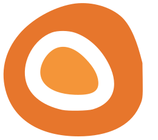

# A computer for curious kids.

A first computer for ages 6–12. Kids read, write, draw, code, and chase their own questions — with AI that helps them make things, not feeds that keep them scrolling.

**[getdaso.com](https://getdaso.com)** · [LinkedIn](https://www.linkedin.com/company/hellodaso/)

 

**Made for making, not scrolling.** Writing, drawing, coding, reading, research. No feeds, no ads, no autoplay, no engagement tricks — a session on Daso ends with your kid going off to build something, not begging for five more minutes.

**Curiosity, kept.** When your kid asks "why are there so many birds outside?", Daso helps them turn it into a real project — researching, collecting, making. The AI is a tool they use to build things, never a pretend friend.

**It grows with your child.** A six-year-old and a twelve-year-old need different computers. Daso adapts to your kid's reading level and hands them more depth exactly as they're ready for it.

**You stay close.** A short note each week about what your kid explored and made, and real ways to jump in. Evidence of learning, not surveillance.

 

We're starting with a handful of curious families — [come build with us](https://getdaso.com).

